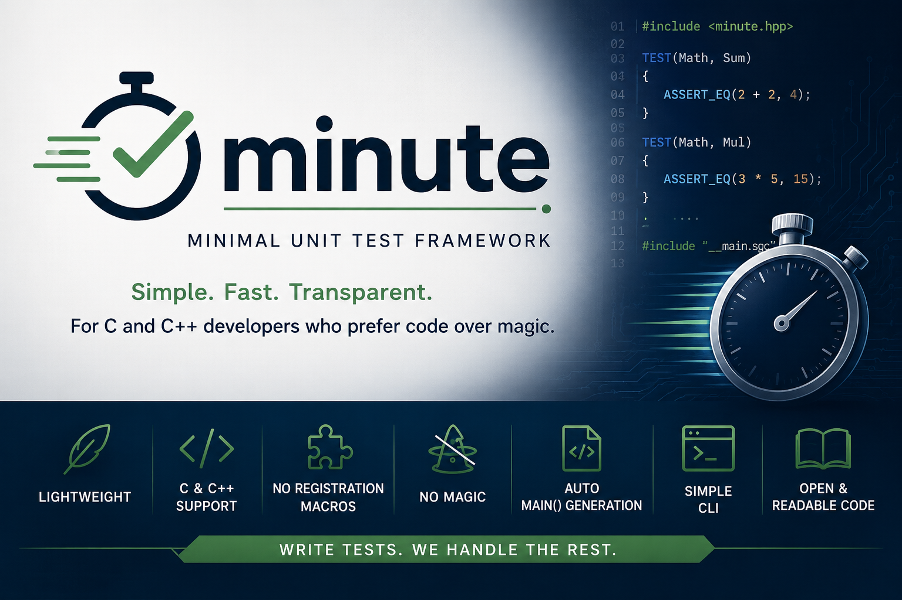
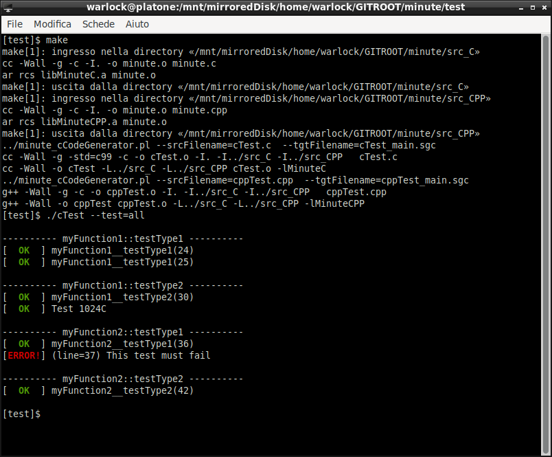
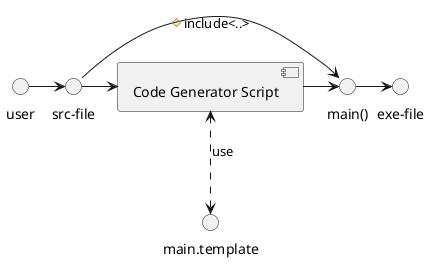

# Minimal Unit Test (minute) framework

## 1.0 Files

|        Files/Dirs        |                 Description                           |
|--------------------------|-------------------------------------------------------|
| images                   | This folder contains picture used for RADME.md files  |
| INSTALL.sh               | Tool to install and uninstall minute software         |
| LICENSE                  | GPL 3 licence                                         |
| minute_cCodeGenerator.pl | The script that generates the main() function         |
| [minute.log]             | It is dinamically created by the installation process |
| src_C                    | This dir contains the library for C language          |
| src_CPP                  | This dir contains the library for C++ language        |
| templates                | It contains the templates used to generate main()     |
| test                     | Some easy test to understand how to use minute soft.  |

## 2.0 Decription

**Minute** is a lightweight Unit Test framework for C and C++.

Unlike most unit test frameworks, Minute does not rely on heavy macros, reflection or compiler-specific tricks. Instead, it
generates the test runner automatically from your source code, keeping both the framework and the generated code simple and
readable.

**Features**

- very small footprint
- supports C and C++
- no registration macros
- automatic `main()` generation
- no external dependencies
- simple Makefile integration
- test selection from command line
- open and readable generated code

### 2.1 "Hello World"
Create a unit test is a very easy task, you just have to include the proper minute's header file, use the TEST() macro instead
the function name, and includes the file that the framework will generate for you with the correct main() function. 
Please, consider this easy example:

	#include <minute.hpp>

	TEST(Math, Sum)
	{
	    ASSERT_EQ(2 + 2, 4);
	}

	TEST(Math, Mul)
	{
	    ASSERT_EQ(3 * 5, 15);
	}

	#include "./__main.sgc"

Now you can use Makefile to automatize all needed steps
	
	CODEGEN   ?= /usr/local/share/minute/minute_cCodeGenerator.pl
  	MINUTELIB ?= -L/usr/local/lib -lMinuteCPP

	myTest.o:	myTest.cpp __main.sgc
			g++ -Wall -c -o $@ $<

	myTest:	myTest.o
			g++ -Wall -o $@ $^ $(MINUTELIB)

	__main.sgc:	myTest.cpp
			$(CODEGEN) -srcFilename=$< --tgtFilename=$@

## 3.0 How to execute your unit-test with minute
The main() function created by the code generator provides you the functionality you need to select the test (or a group of them)
you want to execute, using the following syntax:

	myTest --test={all|<n>|<range>} [--help] [--verbose]

**help**: it is a very usefull option, because it also prints all available tests and their numeric id, you can use the ids to select
their execution

**verbose**: if you have implemented this functionality in your tests, then you can enable it using this file argument

**test**: it allows tou to select which developed test you want to run. This option accepts the following syntax:

- all:         it executes all available tests
- <n>:         it runs only the test with the argument defined numeric ID
- \[<n0>,<n1>\]: it runs all tests where their IDs belong to the argument defined range

### 3.1 MINUTE's test screenshot
The source code files in the <project-home>/test folder, are good examples of how to use this tool to write a unit-test file

## 4.0 How to install minute software
To install and remove minute software, you can use the **INSTALL.sh** bash script, respecting the following syntax:

	./INSTALL.sh [--cmd={install|uninstall}] [--prefix=<folder>]

[!] The default prefix is /usr/local

## 5.0 How minute works
The code-generator script parses your test source-file looking for the TEST() definitions. Then it generates a list with the
functions associated to the user defined tests. When the step is finished, the script will select the proper template and will
compile it using the previousely acquired data. Then it will create a typical main() function with all common available arguments
management.

